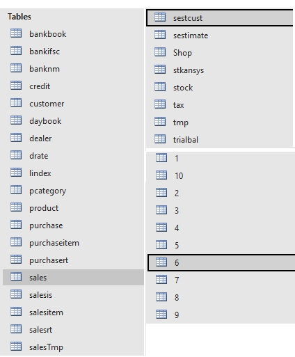

# my_sales_book
Legacy Billing and Inventory Management System built using Visual Basic.
This application was built for small retail businesses to manage product inventory, generate invoices, and track sales etc.

📅 Project Timeline

  Development Started: [Dec / 2018] — Initial design and database schema creation.
  
  Production Launch: [July / 2019] — First used live for daily retail billing and bookkeeping at a retail shop.

## Features

• Product management  
• Customer management  
• Daybook and Ledger Management  
• Billing and invoice generation  
• Stock tracking  
• Purchase and Sales reports  

## Technology Stack

Visual Basic 6.0  
MS Access Database

## Application Screens

### Login Screen

### Billing Screen

### Product Entry

More screenshots are available in the screenshots/windows folder.

## Database Tables

## Note

This repository showcases a legacy production application.  
The full source code is not included because it was developed for a production environment.

## Author

Subeesh Palamadathil

  

  
